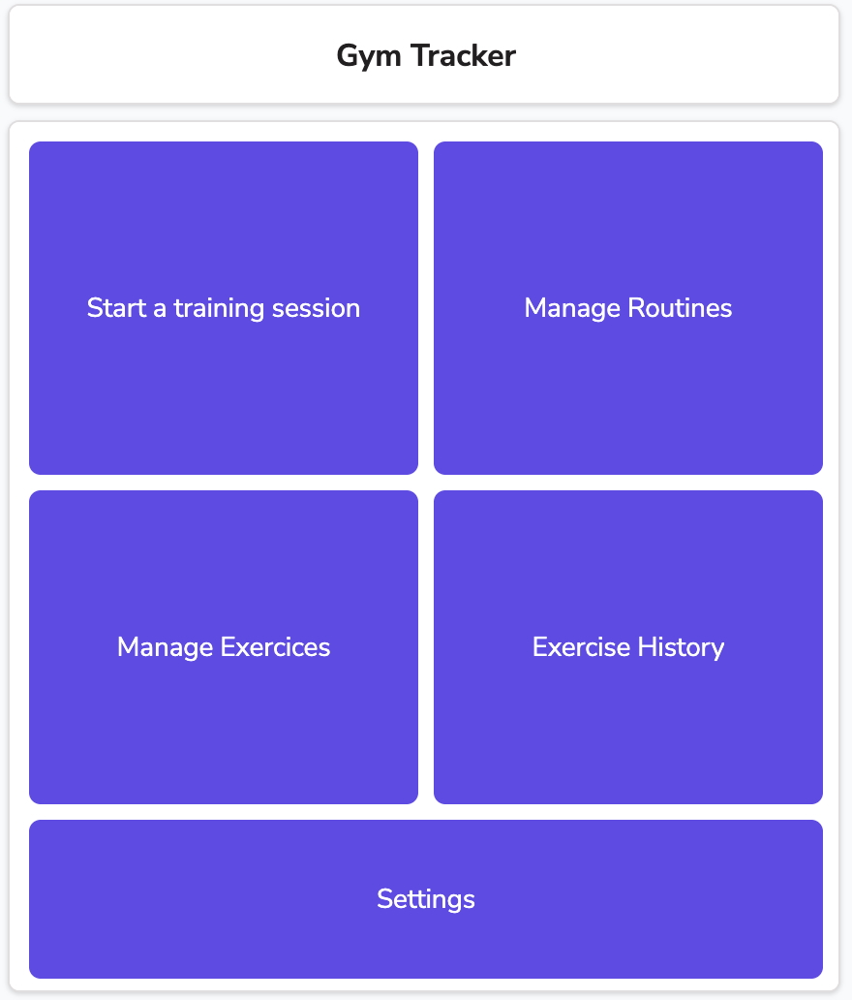
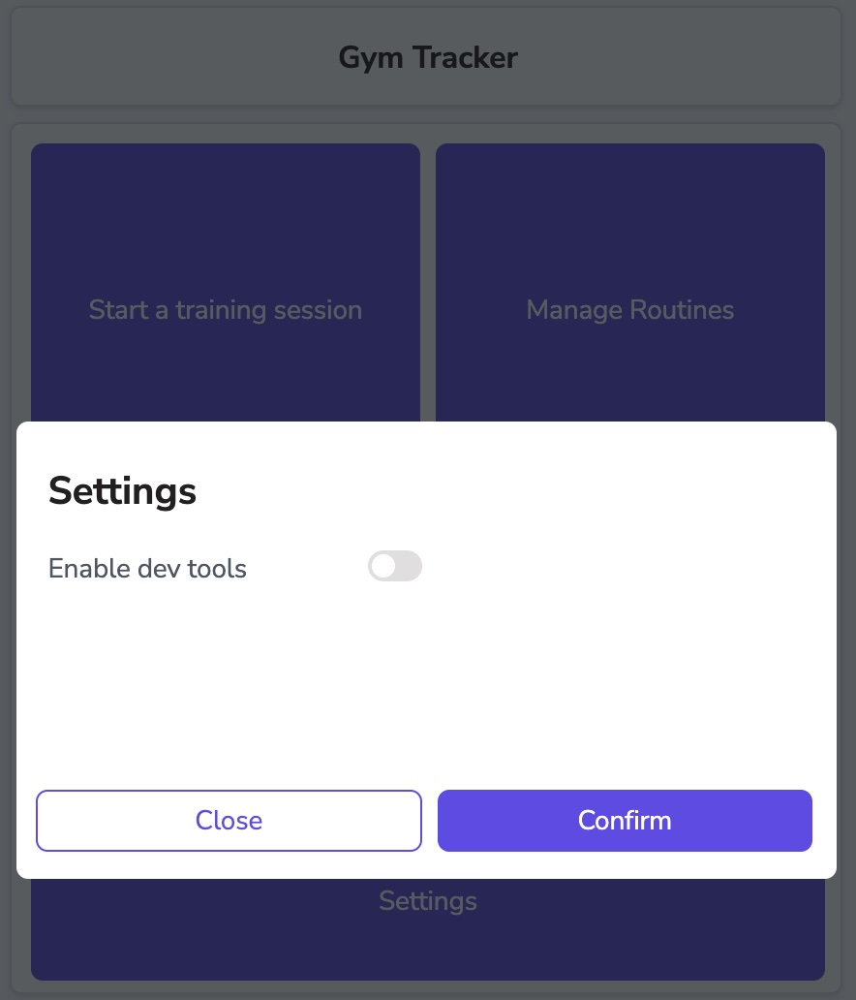
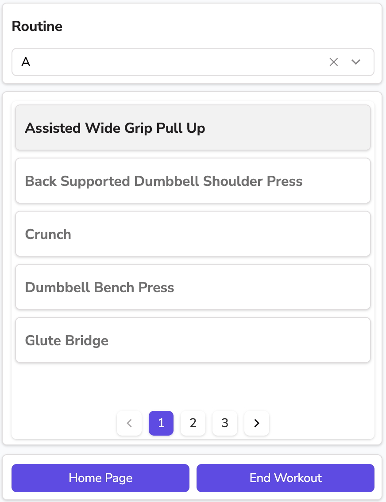
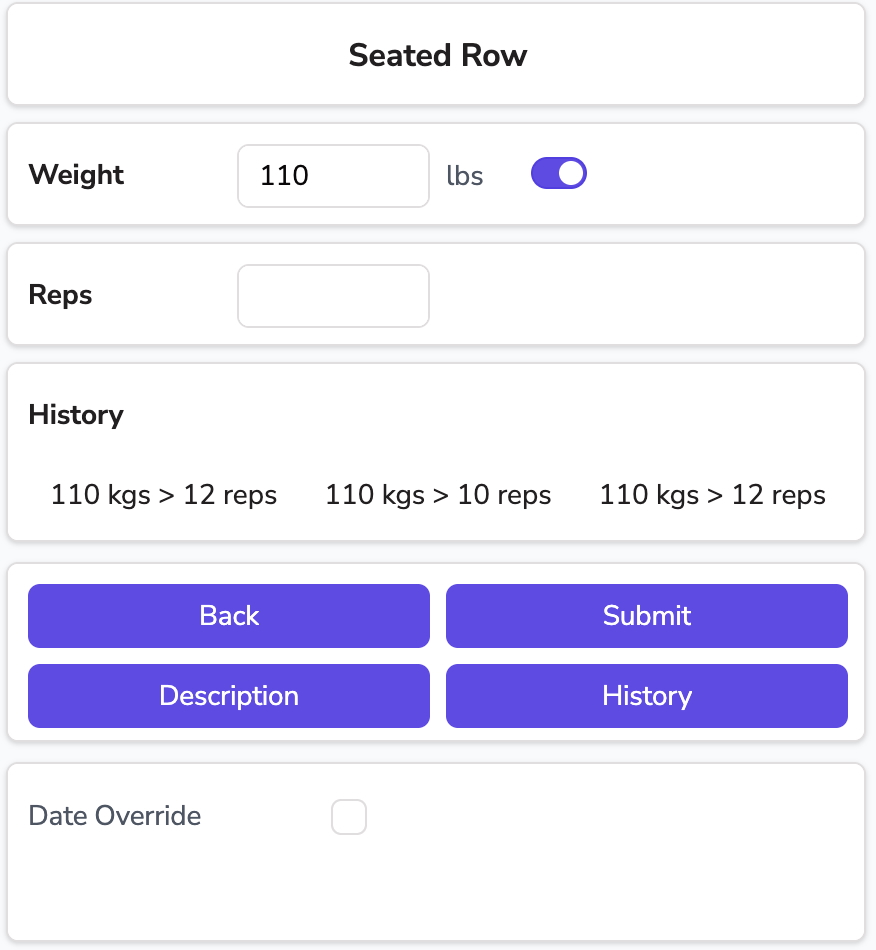

# GymLog 🏋️

A personal gym activity tracker built with [Appsmith](https://www.appsmith.com/) and hosted on [Neon](https://neon.tech/).  
This app helps me log workouts, track progress, and eventually extract personal data insights.

---

## 📌 Features

- Log exercises with sets, reps, weights, and notes
- Shows history for weight increase and displays video for exercise guidance
- Visual overview of activity over time
- Built with Appsmith (drag-and-drop + custom logic)
- PostgreSQL database hosted on Neon
- Future plans: export data for analysis, weekly summaries, personal records

---

## 🔧 Recent Improvements

Over the last updates, GymLog has seen several refinements aimed at improving performance, usability, and clarity of data. Here's a summary of the main changes:

### 🎨 1. Improved UI & Layout Responsiveness
- **Button Enhancements**: All key buttons are now full-width and stretch to fit screen sizes for better mobile and tablet usability.
- **Modular Layout**: Switched to more container-based design patterns for improved UI modularity, alignment, and future scalability.
- **Cleaner Interaction Zones**: Inputs and interactive components have better spacing and sizing for easier use during workouts.

### 🔄 2. Smarter Read/Write Strategy
- **End-of-Workout Sync**: Data is now written to the database only when the workout ends, reducing frequent read/write operations.
- **Optimized Performance**: This change conserves compute and reduces unnecessary database transactions on Neon.

### 👀 3. Toggle Between Local & DB Data
- **Visual Fallbacks**: For recent workout history (last 3 logs), the app applies **conditional formatting (highlighting)** to differentiate between:
  - **Local store values** — used when a workout is still in progress.
  - **Database values** — used for completed sessions.
- This provides near-instant feedback without requiring a database round-trip (when the log lacks a saved timestamp).
- Helps users spot unlogged sets quickly and **reduces the chance of forgetting to log a rep**.

### 📅 4. Optional Date Override for Logs
- Added a toggle-controlled manual date picker when logging sets.
- Allows users to **backfill workouts** by choosing a specific date/time for the log.
- Perfect for cases where you forgot to log a workout or want to import past data.

### 🛠️ 5. Dev Tools Toggle (Settings Menu)
- Added a developer setting to show/hide internal debug containers using a toggle.

### 📄 6. Server-Side Pagination for History Logs
- Implemented **server-side pagination** on workout history and logs view.
- Only fetches the current page of data from the database instead of loading all rows at once.
- This significantly **reduces read-heavy database operations** and improves loading performance for users with large data histories.

---

## 📷 Screenshots

| Home Page | Settings |
|-----------|-----------|
|  |  |

| Routine/Exercises selection | Log Page |
|-----------|-----------|
|  |  |

---

## 🚀 Planned Improvements

Development is ongoing, and here are some features planned for upcoming releases:

### 🧩 1. Unified Exercise & Routine Management
- Revamp and merge the current **Manage Exercises** and **Manage Routines** pages.
- Create a **centralized interface** to:
  - Add/edit existing exercises
  - Assign exercises to routines
  - Create new routines in the same view
- Goal: streamline workflow and reduce navigation overhead.

### ✏️ 2. Edit & Delete Log Entries
- Add support for editing or deleting past log entries — both:
  - **Committed logs** (saved to the database)
  - **Uncommitted logs** (in local store, before saving)
- Useful for correcting mistakes or managing incomplete sets.

### 📊 Future Ideas & Improvements

- **Personal Records (PR) Tracking**  
  Automatically detect and highlight new PRs (heaviest lift, most reps, etc.) per exercise.

- **Workout Summaries & Stats**  
  Weekly/monthly summaries with charts: total volume, frequency, and top lifts.

- **Data Export**  
  Export workout history as CSV or JSON for use in external tools (e.g., spreadsheets, Python notebooks).

___

## 🗃️ Database Schema

The app is backed by a PostgreSQL database hosted on Neon. Here's the current schema:

```sql
-- logs table
CREATE TABLE log (
    id INTEGER PRIMARY KEY GENERATED ALWAYS AS IDENTITY,
    created_at TIMESTAMPTZ NOT NULL DEFAULT now(),
    updated_at TIMESTAMPTZ DEFAULT now(),
    exercise_id INTEGER NOT NULL,
    weight NUMERIC(5,2) NOT NULL,
    reps INTEGER NOT NULL,
    is_lbs BOOLEAN NOT NULL DEFAULT true,

    CONSTRAINT fk_exercise FOREIGN KEY (exercise_id)
        REFERENCES public.exercises(id)
);

-- exercises table
CREATE TABLE exercises (
    id INTEGER PRIMARY KEY GENERATED ALWAYS AS IDENTITY,
    name TEXT UNIQUE NOT NULL,
    description TEXT,
    created_at TIMESTAMPTZ NOT NULL DEFAULT now(),
    updated_at TIMESTAMPTZ DEFAULT now(),
    video_url TEXT,

    CONSTRAINT exercises_pkey PRIMARY KEY (id),
    CONSTRAINT exercises_name_key UNIQUE (name)
);

-- routines table
CREATE TABLE routines (
    id INTEGER PRIMARY KEY GENERATED ALWAYS AS IDENTITY,
    routine_name TEXT NOT NULL,
    created_at TIMESTAMPTZ DEFAULT now(),
    updated_at TIMESTAMPTZ DEFAULT now()
);

-- routine_exercises table
CREATE TABLE routine_exercises (
    routine_id INTEGER,
    exercise_id INTEGER,
    rank TEXT,
    created_at TIMESTAMPTZ DEFAULT now(),
    updated_at TIMESTAMPTZ DEFAULT now(),
    
    CONSTRAINT routine_exercises_pkey PRIMARY KEY (routine_id, exercise_id),
    CONSTRAINT routine_exercises_routine_id_fkey FOREIGN KEY (routine_id)
        REFERENCES public.routines(id) ON DELETE CASCADE,
    CONSTRAINT routine_exercises_exercise_id_fkey FOREIGN KEY (exercise_id)
        REFERENCES public.exercises(id) ON DELETE CASCADE
);
