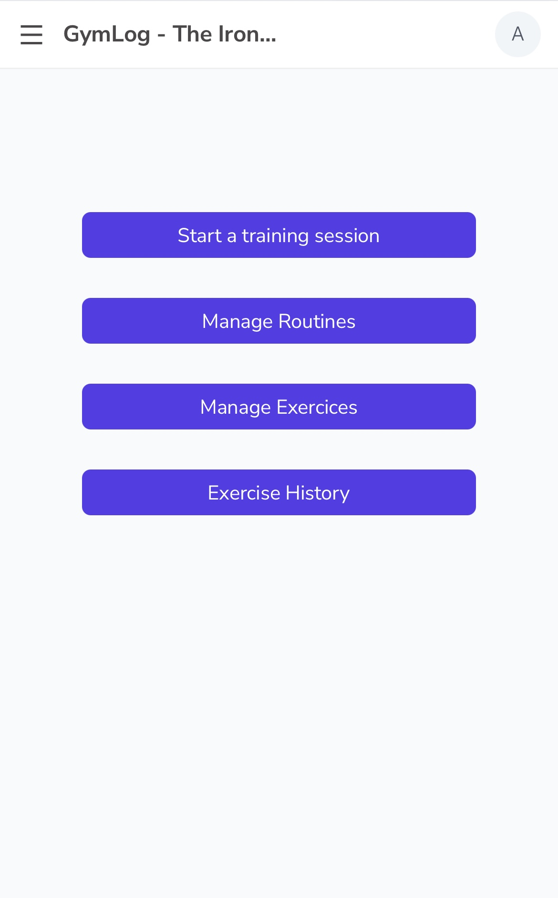
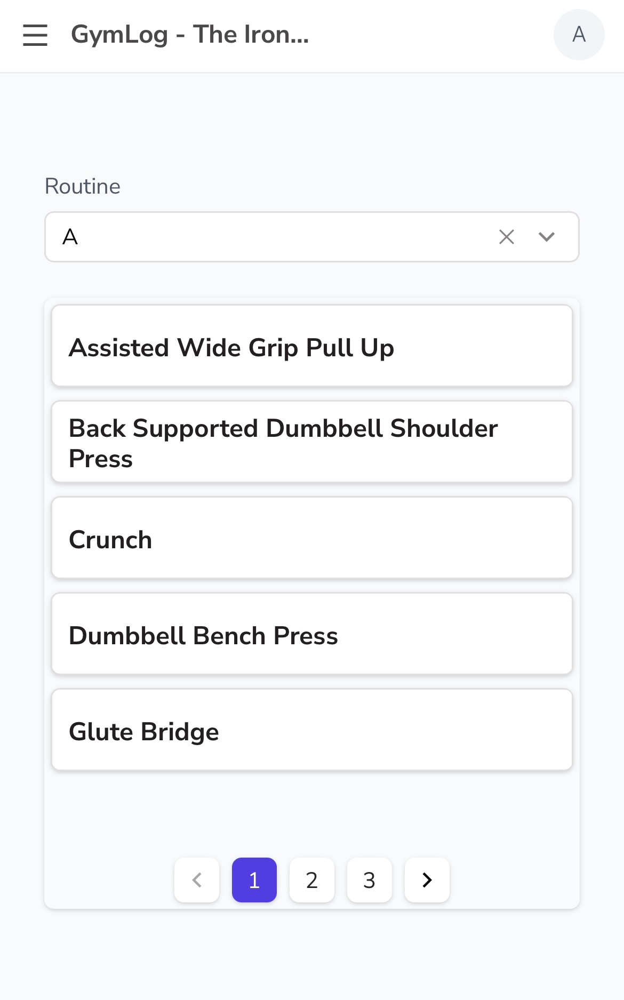

# GymLog 🏋️ - The Iron Journals

A personal gym activity tracker built with [Appsmith](https://www.appsmith.com/) and hosted on [Neon](https://neon.tech/).  
This app helps me log workouts, track progress, and eventually extract personal data insights.

---

## 📌 Features

- Log exercises with sets, reps, weights, and notes
- Shows history for weight increase and displays video for exercise guidance
- Visual overview of activity over time
- Built with Appsmith (drag-and-drop + custom logic)
- PostgreSQL database hosted on Neon
- Future plans: export data for analysis, weekly summaries, personal records

---

## 📷 Screenshots

| Home Page | Routine/Exercise Selector |
|-----------|-----------|
|  |  |
| Home Page | Routine/Exercise Selector |
|-----------|-----------|
|  |  |

---

## 🗃️ Database Schema

The app is backed by a PostgreSQL database hosted on Neon. Here's the current schema:

```sql
-- logs table
CREATE TABLE log (
    id INTEGER PRIMARY KEY GENERATED ALWAYS AS IDENTITY,
    created_at TIMESTAMPTZ NOT NULL DEFAULT now(),
    updated_at TIMESTAMPTZ DEFAULT now(),
    exercise_id INTEGER NOT NULL,
    weight NUMERIC(5,2) NOT NULL,
    reps INTEGER NOT NULL,
    is_lbs BOOLEAN NOT NULL DEFAULT true,

    CONSTRAINT fk_exercise FOREIGN KEY (exercise_id)
        REFERENCES public.exercises(id)
);

-- exercises table
CREATE TABLE exercises (
    id INTEGER PRIMARY KEY GENERATED ALWAYS AS IDENTITY,
    name TEXT UNIQUE NOT NULL,
    description TEXT,
    created_at TIMESTAMPTZ NOT NULL DEFAULT now(),
    updated_at TIMESTAMPTZ DEFAULT now(),
    video_url TEXT,

    CONSTRAINT exercises_pkey PRIMARY KEY (id),
    CONSTRAINT exercises_name_key UNIQUE (name)
);

-- routines table
CREATE TABLE routines (
    id INTEGER PRIMARY KEY GENERATED ALWAYS AS IDENTITY,
    routine_name TEXT NOT NULL,
    created_at TIMESTAMPTZ DEFAULT now(),
    updated_at TIMESTAMPTZ DEFAULT now()
);

-- routine_exercises table
CREATE TABLE routine_exercises (
    routine_id INTEGER,
    exercise_id INTEGER,
    rank TEXT,
    created_at TIMESTAMPTZ DEFAULT now(),
    updated_at TIMESTAMPTZ DEFAULT now(),
    
    CONSTRAINT routine_exercises_pkey PRIMARY KEY (routine_id, exercise_id),
    CONSTRAINT routine_exercises_routine_id_fkey FOREIGN KEY (routine_id)
        REFERENCES public.routines(id) ON DELETE CASCADE,
    CONSTRAINT routine_exercises_exercise_id_fkey FOREIGN KEY (exercise_id)
        REFERENCES public.exercises(id) ON DELETE CASCADE
);
